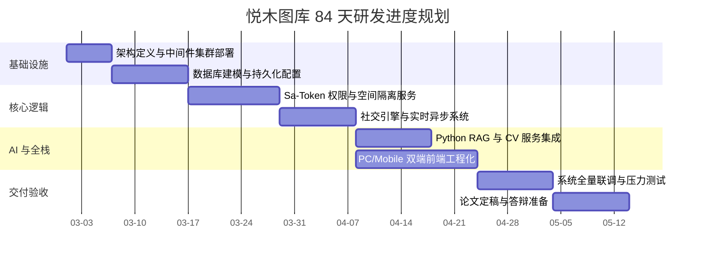

```mermaid
gantt
    title 悦木图库 84 天研发进度规划
    dateFormat  YYYY-MM-DD
    axisFormat  %m-%d
    todayMarker off

    section 基础设施
    架构定义与中间件集群部署    :a1, 2024-03-01, 6d
    数据库建模与持久化配置     :a2, after a1, 10d

    section 核心逻辑
    Sa-Token 权限与空间隔离服务 :b1, after a2, 12d
    社交引擎与实时异步系统     :b2, after b1, 10d

    section AI 与全栈
    Python RAG 与 CV 服务集成  :c1, after b2, 10d
    PC/Mobile 双端前端工程化   :c2, after b2, 16d

    section 交付验收
    系统全量联调与压力测试     :d1, after c2, 10d
    论文定稿与答辩准备        :d2, after d1, 10d

```